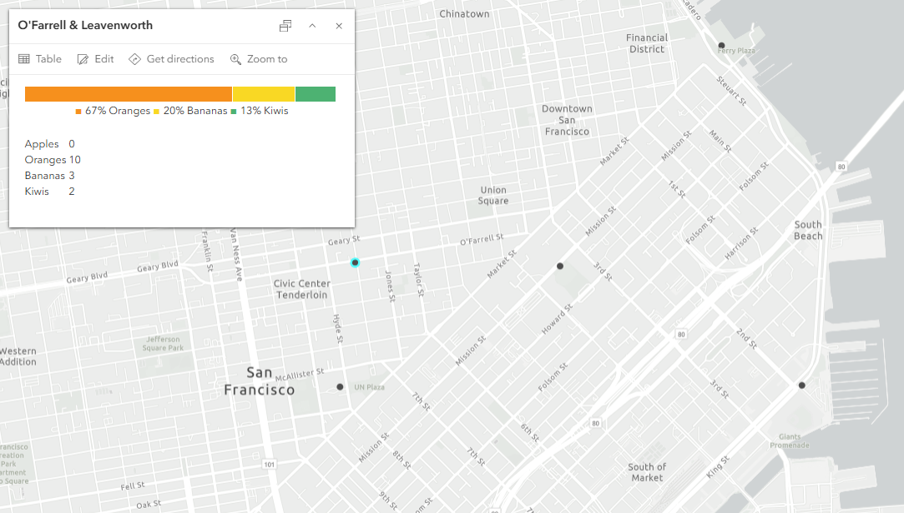
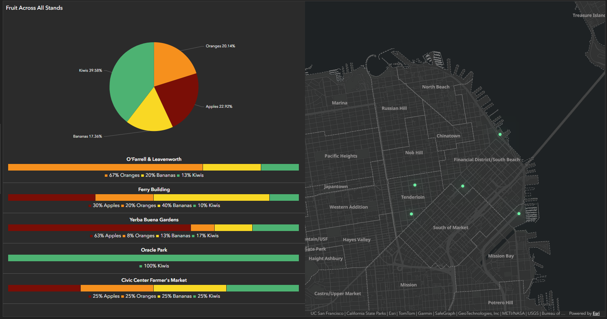
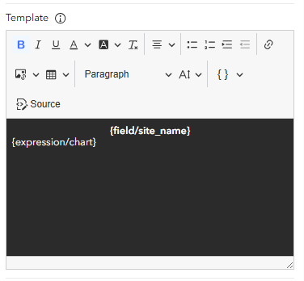

# Making Bar Charts in ArcGIS Dashboards with Arcade


Generate lightweight horizontal bar charts using only **Arcade** and **HTML**. These charts work in ArcGIS Dashboards, web map popups, lists, tables, and anywhere Arcade expressions can return HTML.

## Overview

Arcade doesn't include built-in charting capabilities, but you can create simple stacked bar charts by generating HTML tables with colored cells.

This repository provides a reusable `makeBarChart()` function that:

* Creates horizontal stacked bar charts from arrays of values.
* Automatically converts whole numbers to percentages (optional).
* Omits very small segments to keep charts readable.
* Generates a matching legend beneath each chart.
* Works anywhere Arcade supports HTML output.

---

## How It Works

The chart is built from a few small helper functions:
* [`makePatch`](https://github.com/vlingenfelter/arcade-2026/tree/main#makepatchcolor)
* [`makeBarChunk`](https://github.com/vlingenfelter/arcade-2026/tree/main#makebarchunkcolor-width)
* [`convertArrayToDecimal`](https://github.com/vlingenfelter/arcade-2026/tree/main#convertarraytodecimalarray)
* [`makeBarChart`](https://github.com/vlingenfelter/arcade-2026/tree/main#makebarchartcolors-values-labels-convert)

### `makePatch(color)`

Creates a colored square used in the chart legend.

**Input**

* `color` *(String)* — HTML color name or hexadecimal color code.

**Returns**

* HTML string

```javascript
function makePatch(color) {
    var div = '<span style="font-size:medium; color:' + color + ';"> &#9632; </span>';
    return div;
}
```

---

### `makeBarChunk(color, width)`

Creates a single colored segment of the stacked bar.

**Inputs**

| Parameter | Type   | Description                                 |
| --------- | ------ | ------------------------------------------- |
| `color`   | String | HTML color or hex code                      |
| `width`   | String | Width as a percentage (for example `"35%"`) |

**Returns**

* HTML string

```javascript
function makeBarChunk(color, width) {
    var td = '<td style="background-color:' + color + '; width:' + width + '">&nbsp;</td>';
    return td;
}
```

---

### `convertArrayToDecimal(array)`

Converts an array of counts into decimal proportions that sum to 1. For example, `[50, 30, 20]` becomes `[0.5, 0.3, 0.2]`

Use this when your input values are counts instead of percentages.

```javascript
function convertArrayToDecimal(array) {
    var decimalArray = [];
    var denominator = Sum(array);

    for (var i in array) {
        decimalArray[i] = array[i] / denominator;
    }

    return decimalArray;
}
```

---

### `makeBarChart(colors, values, labels, convert)`

Generates the complete bar chart and legend.

### Parameters

| Parameter | Type    | Description                     |
| --------- | ------- | ------------------------------- |
| `colors`  | Array   | Color for each category         |
| `values`  | Array   | Counts or decimal percentages   |
| `labels`  | Array   | Label for each category         |
| `convert` | Boolean | If true, convert counts into percentages |

### Returns

A string containing HTML that can be returned from an Arcade expression.

Example input:
```javascript
colors = ["maroon", "peru", "grey", "seagreen"]
values = [60, 35, 0, 5]
labels = ["Down", "Partial", "Unknown", "Up"]
```
or, if already normalized:
```javascript
values = [0.60, 0.35, 0.00, 0.05]
```

The function automatically:
* Converts counts to percentages (optional)
* Skips segments smaller than 1%
* Creates the stacked bar
* Builds a matching legend

```
function makeBarChart(colors, values, labels, convert) {
	// convert the values to decimals if necessary 
	if (convert) {
			values = convertArrayToDecimal(values)
	    Console(values)
	}
	
  var barHtml = ''
  var labelHtml = ''

  barHtml += '<table style="width:100%"><tbody><tr><td><table style="width:100%"><tbody><tr>';
  labelHtml = '<div style="text-align: center"><p style="display: inline-block; text-align: left;">';
  
  // loop through each item in the color array
  // if the value is too small to be meaningful, skip that chunk and that label
  for(var i in colors) {
    if (values[i] > 0.01) {
      var percent = Round(values[i], 2) * 100 + '%'
      barHtml += makeBarChunk(colors[i], percent);
      labelHtml +=  makePatch(colors[i]) + percent + " " + labels[i] + " ";
    }
  }

  barHtml += '<td style="font-size:0px" width="0%">&nbsp;</td></tr></tbody></table></td></tr></tbody></table>'
  labelHtml += "</p></div>"

  return barHtml + labelHtml
}
```

---

# Examples

All examples were created using a [demo feature layer](https://sfgov.maps.arcgis.com/home/item.html?id=a274afabf00046fda7756afc482fe1d0#overview). If you would like to recreate these examples, the feature layer is public. 

There is also an [example ArcGIS Dashboard](https://sfgov.maps.arcgis.com/apps/dashboards/628fc37f0b494cb6ad03d6145bd261d8) available to look at. 

## Web Map Popup

The following Arcade expression creates a stacked bar chart showing the distribution of fruit counts. 



```javascript
\\ copy this after importing the helper functions

var featureArray = [$feature.Apples, $feature.Bananas, $feature.Kiwis, $feature.Oranges ];
var colorArray = ["maroon", "yellow", "green", "orange"];
var labelArray = ["Apples", "Bananas", "Kiwis", "Oranges" ];

var chart = makeBarChart(
    colorArray,
    featureArray,
    labelArray,
    True
);

return {
    type: "text",
    text: chart
};
```

---

## ArcGIS Dashboards

### Table Cells

The same functions also work inside Dashboard Table elements, by going to the "Values" option and enabling "Advanced Formatting", and working in Arcade there. To get the horizontal bar charts to render in the table, you will need to add an extra value field that will be replaced with the bar chart. For this example, the extra value field I used is "Oranges".


```javascript
\\ copy this after importing the helper functions

var featureArray = [$datapoint.apples, $datapoint.oranges, $datapoint.Bananas, $datapoint.kiwis];
var colorArray = ["maroon", "DarkOrange", "gold", "MediumSeaGreen"];
var labelArray = ["Apples", "Oranges", "Bananas", "Kiwis"];

var chart = makeBarChart(colorArray, featureArray, labelArray, True)

return {
  cells: {
    oranges: {
      displayText : chart,
      textColor: '',
      backgroundColor: '',
      textAlign: 'right',
      iconName: '',
      iconAlign: '',
      iconColor: '',
      iconOutlineColor: ''
    },
		
    site_name: {
      displayText : $datapoint.site_name,
      textColor: '',
      backgroundColor: '',
      textAlign: 'left',
      iconName: '',
      iconAlign: '',
      iconColor: '',
      iconOutlineColor: ''
    },
		
  }
}
```
---

### Lists

The same functions also work inside Dashboard List elements, by going to the "List" option and enabling "Advanced Formatting".



```javascript
\\ copy this after importing the helper functions

var featureArray = [$datapoint.apples, $datapoint.oranges, $datapoint.Bananas, $datapoint.kiwis];
var colorArray = ["maroon", "DarkOrange", "gold", "MediumSeaGreen"];
var labelArray = ["Apples", "Oranges", "Bananas", "Kiwis"];

var chart = makeBarChart(colorArray, featureArray, labelArray, True)

return {
  textColor: '',
  backgroundColor: '',
  separatorColor:'',
  selectionColor: '',
  selectionTextColor: '',
  attributes: {
    chart: chart,
  }
}
```
To make the chart visible in the list, add {expression/chart} to your list Template. 



---

# Notes

* Values should either be counts or decimal percentages that sum to **1.0**.
* Segments smaller than **1%** are hidden to improve readability.
* Colors can be HTML color names (for example, `"red"` or `"seagreen"`) or hexadecimal values (for example, `"#2E8B57"`).
* Since the output is pure HTML, it works anywhere Arcade supports HTML text output.
